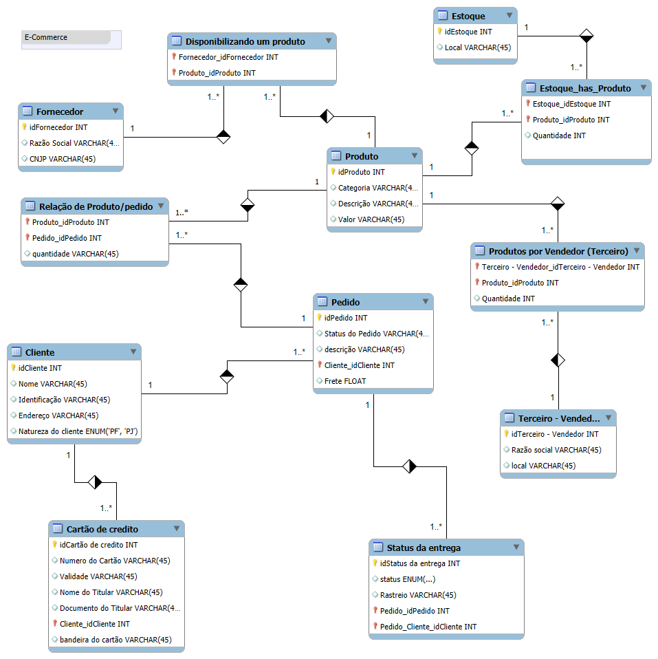

# Projeto Base: Refinando um Projeto Conceitual de Banco de Dados – E-COMMERCE



## SQL

### Explicação do Modelo de Banco de Dados

O script define um modelo de banco de dados chamado `mydb`, composto por várias tabelas interligadas para gerenciar informações sobre clientes, pedidos, produtos, fornecedores, estoques e outros aspectos de uma operação comercial. A seguir, um resumo do que cada tabela representa:

#### 1. Clientes
Armazena informações básicas de identificação, como:
- Nome
- Identificação
- Tipo de cliente (Pessoa Física ou Jurídica)

#### 2. Pedidos
Relaciona os pedidos aos clientes, registrando:
- Status
- Descrição
- Valor do frete

#### 3. Produtos
Descreve os itens disponíveis, categorizados com atributos como:
- Descrição
- Categoria
- Valor

#### 4. Fornecedores
Contém dados sobre empresas fornecedoras, como:
- Razão Social
- CNPJ
- Relação com os produtos disponibilizados

#### 5. Estoques
Define a localização dos estoques e relaciona os produtos armazenados através de uma tabela intermediária.

#### 6. Status da Entrega
Gerencia e rastreia os estados de entrega dos pedidos, como:
- "preparando"
- "enviando"
- "entregue"
- "falha"

#### 7. Cartões de Crédito
Vincula informações de pagamento aos clientes respectivos, como:
- Número do cartão
- Titularidade
- Bandeira

### Principais Recursos do Modelo

- **Integridade Relacional**: Uso de chaves estrangeiras para conectar as tabelas relacionadas.
- **Índices**: Melhora a eficiência e velocidade das consultas no banco de dados.
- **Flexibilidade**: O modelo permite rastrear informações essenciais para um sistema comercial robusto.

```sql
-- MySQL Script generated by MySQL Workbench
-- Wed Apr 23 00:13:25 2025
-- Model: New Model    Version: 1.0
-- MySQL Workbench Forward Engineering

SET @OLD_UNIQUE_CHECKS=@@UNIQUE_CHECKS, UNIQUE_CHECKS=0;
SET @OLD_FOREIGN_KEY_CHECKS=@@FOREIGN_KEY_CHECKS, FOREIGN_KEY_CHECKS=0;
SET @OLD_SQL_MODE=@@SQL_MODE, SQL_MODE='ONLY_FULL_GROUP_BY,STRICT_TRANS_TABLES,NO_ZERO_IN_DATE,NO_ZERO_DATE,ERROR_FOR_DIVISION_BY_ZERO,NO_ENGINE_SUBSTITUTION';

-- -----------------------------------------------------
-- Schema mydb
-- -----------------------------------------------------

-- -----------------------------------------------------
-- Schema mydb
-- -----------------------------------------------------
CREATE SCHEMA IF NOT EXISTS `mydb` DEFAULT CHARACTER SET utf8 ;
USE `mydb` ;

-- -----------------------------------------------------
-- Table `mydb`.`Cliente`
-- -----------------------------------------------------
CREATE TABLE IF NOT EXISTS `mydb`.`Cliente` (
  `idCliente` INT NOT NULL,
  `Nome` VARCHAR(45) NULL,
  `Identificação` VARCHAR(45) NULL,
  `Endereço` VARCHAR(45) NULL,
  `Natureza do cliente` ENUM('PF', 'PJ') NULL,
  PRIMARY KEY (`idCliente`))
ENGINE = InnoDB;

-- -----------------------------------------------------
-- Table `mydb`.`Pedido`
-- -----------------------------------------------------
CREATE TABLE IF NOT EXISTS `mydb`.`Pedido` (
  `idPedido` INT NOT NULL,
  `Status do Pedido` VARCHAR(45) NULL,
  `descrição` VARCHAR(45) NULL,
  `Cliente_idCliente` INT NOT NULL,
  `Frete` FLOAT NULL,
  PRIMARY KEY (`idPedido`, `Cliente_idCliente`),
  INDEX `fk_Pedido_Cliente1_idx` (`Cliente_idCliente` ASC) VISIBLE,
  CONSTRAINT `fk_Pedido_Cliente1`
    FOREIGN KEY (`Cliente_idCliente`)
    REFERENCES `mydb`.`Cliente` (`idCliente`)
    ON DELETE NO ACTION
    ON UPDATE NO ACTION)
ENGINE = InnoDB;

-- -----------------------------------------------------
-- Table `mydb`.`Produto`
-- -----------------------------------------------------
CREATE TABLE IF NOT EXISTS `mydb`.`Produto` (
  `idProduto` INT NOT NULL,
  `Categoria` VARCHAR(45) NULL,
  `Descrição` VARCHAR(45) NULL,
  `Valor` VARCHAR(45) NULL,
  PRIMARY KEY (`idProduto`))
ENGINE = InnoDB;

-- -----------------------------------------------------
-- Table `mydb`.`Fornecedor`
-- -----------------------------------------------------
CREATE TABLE IF NOT EXISTS `mydb`.`Fornecedor` (
  `idFornecedor` INT NOT NULL,
  `Razão Social` VARCHAR(45) NULL,
  `CNJP` VARCHAR(45) NULL,
  PRIMARY KEY (`idFornecedor`))
ENGINE = InnoDB;

-- -----------------------------------------------------
-- Table `mydb`.`Disponibilizando um produto`
-- -----------------------------------------------------
CREATE TABLE IF NOT EXISTS `mydb`.`Disponibilizando um produto` (
  `Fornecedor_idFornecedor` INT NOT NULL,
  `Produto_idProduto` INT NOT NULL,
  PRIMARY KEY (`Fornecedor_idFornecedor`, `Produto_idProduto`),
  INDEX `fk_Fornecedor_has_Produto_Produto1_idx` (`Produto_idProduto` ASC) VISIBLE,
  INDEX `fk_Fornecedor_has_Produto_Fornecedor_idx` (`Fornecedor_idFornecedor` ASC) VISIBLE,
  CONSTRAINT `fk_Fornecedor_has_Produto_Fornecedor`
    FOREIGN KEY (`Fornecedor_idFornecedor`)
    REFERENCES `mydb`.`Fornecedor` (`idFornecedor`)
    ON DELETE NO ACTION
    ON UPDATE NO ACTION,
  CONSTRAINT `fk_Fornecedor_has_Produto_Produto1`
    FOREIGN KEY (`Produto_idProduto`)
    REFERENCES `mydb`.`Produto` (`idProduto`)
    ON DELETE NO ACTION
    ON UPDATE NO ACTION)
ENGINE = InnoDB;

-- -----------------------------------------------------
-- Table `mydb`.`Estoque`
-- -----------------------------------------------------
CREATE TABLE IF NOT EXISTS `mydb`.`Estoque` (
  `idEstoque` INT NOT NULL,
  `Local` VARCHAR(45) NULL,
  PRIMARY KEY (`idEstoque`))
ENGINE = InnoDB;

-- -----------------------------------------------------
-- Table `mydb`.`Estoque_has_Produto`
-- -----------------------------------------------------
CREATE TABLE IF NOT EXISTS `mydb`.`Estoque_has_Produto` (
  `Estoque_idEstoque` INT NOT NULL,
  `Produto_idProduto` INT NOT NULL,
  `Quantidade` INT NULL,
  PRIMARY KEY (`Estoque_idEstoque`, `Produto_idProduto`),
  INDEX `fk_Estoque_has_Produto_Produto1_idx` (`Produto_idProduto` ASC) VISIBLE,
  INDEX `fk_Estoque_has_Produto_Estoque1_idx` (`Estoque_idEstoque` ASC) VISIBLE,
  CONSTRAINT `fk_Estoque_has_Produto_Estoque1`
    FOREIGN KEY (`Estoque_idEstoque`)
    REFERENCES `mydb`.`Estoque` (`idEstoque`)
    ON DELETE NO ACTION
    ON UPDATE NO ACTION,
  CONSTRAINT `fk_Estoque_has_Produto_Produto1`
    FOREIGN KEY (`Produto_idProduto`)
    REFERENCES `mydb`.`Produto` (`idProduto`)
    ON DELETE NO ACTION
    ON UPDATE NO ACTION)
ENGINE = InnoDB;

-- -----------------------------------------------------
-- Table `mydb`.`Relação de Produto/pedido`
-- -----------------------------------------------------
CREATE TABLE IF NOT EXISTS `mydb`.`Relação de Produto/pedido` (
  `Produto_idProduto` INT NOT NULL,
  `Pedido_idPedido` INT NOT NULL,
  `quantidade` VARCHAR(45) NULL,
  PRIMARY KEY (`Produto_idProduto`, `Pedido_idPedido`),
  INDEX `fk_Produto_has_Pedido_Pedido1_idx` (`Pedido_idPedido` ASC) VISIBLE,
  INDEX `fk_Produto_has_Pedido_Produto1_idx` (`Produto_idProduto` ASC) VISIBLE,
  CONSTRAINT `fk_Produto_has_Pedido_Produto1`
    FOREIGN KEY (`Produto_idProduto`)
    REFERENCES `mydb`.`Produto` (`idProduto`)
    ON DELETE NO ACTION
    ON UPDATE NO ACTION,
  CONSTRAINT `fk_Produto_has_Pedido_Pedido1`
    FOREIGN KEY (`Pedido_idPedido`)
    REFERENCES `mydb`.`Pedido` (`idPedido`)
    ON DELETE NO ACTION
    ON UPDATE NO ACTION)
ENGINE = InnoDB;

-- -----------------------------------------------------
-- Table `mydb`.`Terceiro - Vendedor`
-- -----------------------------------------------------
CREATE TABLE IF NOT EXISTS `mydb`.`Terceiro - Vendedor` (
  `idTerceiro - Vendedor` INT NOT NULL,
  `Razão social` VARCHAR(45) NULL,
  `local` VARCHAR(45) NULL,
  PRIMARY KEY (`idTerceiro - Vendedor`))
ENGINE = InnoDB;

-- -----------------------------------------------------
-- Table `mydb`.`Produtos por Vendedor (Terceiro)`
-- -----------------------------------------------------
CREATE TABLE IF NOT EXISTS `mydb`.`Produtos por Vendedor (Terceiro)` (
  `Terceiro - Vendedor_idTerceiro - Vendedor` INT NOT NULL,
  `Produto_idProduto` INT NOT NULL,
  `Quantidade` INT NULL,
  PRIMARY KEY (`Terceiro - Vendedor_idTerceiro - Vendedor`, `Produto_idProduto`),
  INDEX `fk_Produto_has_Terceiro - Vendedor_Terceiro - Vendedor1_idx` (`Terceiro - Vendedor_idTerceiro - Vendedor` ASC) VISIBLE,
  INDEX `fk_Produto_has_Terceiro - Vendedor_Produto1_idx` (`Produto_idProduto` ASC) VISIBLE,
  CONSTRAINT `fk_Produto_has_Terceiro - Vendedor_Produto1`
    FOREIGN KEY (`Produto_idProduto`)
    REFERENCES `mydb`.`Produto` (`idProduto`)
    ON DELETE NO ACTION
    ON UPDATE NO ACTION,
  CONSTRAINT `fk_Produto_has_Terceiro - Vendedor_Terceiro - Vendedor1`
    FOREIGN KEY (`Terceiro - Vendedor_idTerceiro - Vendedor`)
    REFERENCES `mydb`.`Terceiro - Vendedor` (`idTerceiro - Vendedor`)
    ON DELETE NO ACTION
    ON UPDATE NO ACTION)
ENGINE = InnoDB;

-- -----------------------------------------------------
-- Table `mydb`.`Status da entrega`
-- -----------------------------------------------------
CREATE TABLE IF NOT EXISTS `mydb`.`Status da entrega` (
  `idStatus da entrega` INT NOT NULL,
  `status` ENUM('preparando', 'enviando', 'entregue', 'falha') NULL,
  `Rastreio` VARCHAR(45) NULL,
  `Pedido_idPedido` INT NOT NULL,
  `Pedido_Cliente_idCliente` INT NOT NULL,
  PRIMARY KEY (`idStatus da entrega`, `Pedido_idPedido`, `Pedido_Cliente_idCliente`),
  INDEX `fk_Status da entrega_Pedido1_idx` (`Pedido_idPedido` ASC, `Pedido_Cliente_idCliente` ASC) VISIBLE,
  CONSTRAINT `fk_Status da entrega_Pedido1`
    FOREIGN KEY (`Pedido_idPedido` , `Pedido_Cliente_idCliente`)
    REFERENCES `mydb`.`Pedido` (`idPedido` , `Cliente_idCliente`)
    ON DELETE NO ACTION
    ON UPDATE NO ACTION)
ENGINE = InnoDB;

-- -----------------------------------------------------
-- Table `mydb`.`Cartão de credito`
-- -----------------------------------------------------
CREATE TABLE IF NOT EXISTS `mydb`.`Cartão de credito` (
  `idCartão de credito` INT NOT NULL,
  `Numero do Cartão` VARCHAR(45) NULL,
  `Validade` VARCHAR(45) NULL,
  `Nome do Titular` VARCHAR(45) NULL,
  `Documento do Titular` VARCHAR(45) NULL,
  `Cliente_idCliente` INT NOT NULL,
  `bandeira do cartão` VARCHAR(45) NULL,
  PRIMARY KEY (`idCartão de credito`, `Cliente_idCliente`),
  INDEX `fk_Cartão de credito_Cliente1_idx` (`Cliente_idCliente` ASC) VISIBLE,
  CONSTRAINT `fk_Cartão de credito_Cliente1`
    FOREIGN KEY (`Cliente_idCliente`)
    REFERENCES `mydb`.`Cliente` (`idCliente`)
    ON DELETE NO ACTION
    ON UPDATE NO ACTION)
ENGINE = InnoDB;

SET SQL_MODE=@OLD_SQL_MODE;
SET FOREIGN_KEY_CHECKS=@OLD_FOREIGN_KEY_CHECKS;
SET UNIQUE_CHECKS=@OLD_UNIQUE_CHECKS;
```

### Criação de Índices e Justificativas

#### Índices Criados

1. **Índice para a Tabela `Cliente`**
   ```sql
   ALTER TABLE Cliente ADD INDEX idx_Nome(Nome);
   -- Justificativa: O índice foi criado na coluna `Nome` para otimizar consultas que busquem clientes pelo nome, 
   -- uma operação comum em sistemas de e-commerce.
   ```

2. **Índice para a Tabela `Pedido`**
   ```sql
   CREATE INDEX idx_StatusPedido ON Pedido(`Status do Pedido`);
   -- Justificativa: O índice foi criado na coluna `Status do Pedido` para acelerar consultas que filtram pedidos 
   -- por status, como "entregue" ou "preparando".
   ```

3. **Índice para a Tabela `Produto`**
   ```sql
   CREATE INDEX idx_Categoria ON Produto(Categoria);
   -- Justificativa: O índice foi criado na coluna `Categoria` para melhorar a performance de consultas que agrupam 
   -- ou filtram produtos por categoria.
   ```

### Exemplos de Consultas SQL

#### 1. Recuperações Simples com SELECT Statement

**Exemplo:** Listar todos os clientes cadastrados.
```sql
SELECT * FROM Cliente;
```

#### 2. Filtros com WHERE Statement

**Exemplo:** Listar pedidos com frete maior que 50.
```sql
SELECT * FROM Pedido WHERE Frete > 50;
```

#### 3. Atributos Derivados

**Exemplo:** Calcular o valor total de cada pedido (considerando o frete).
```sql
SELECT idPedido, (Frete + SUM(Produto.Valor)) AS ValorTotal
FROM Pedido
JOIN `Relação de Produto/pedido` ON Pedido.idPedido = `Relação de Produto/pedido`.Pedido_idPedido
JOIN Produto ON `Relação de Produto/pedido`.Produto_idProduto = Produto.idProduto
GROUP BY idPedido;
```

#### 4. Ordenação dos Dados com ORDER BY

**Exemplo:** Listar produtos ordenados pelo valor em ordem decrescente.
```sql
SELECT * FROM Produto ORDER BY Valor DESC;
```

#### 5. Condições de Filtros aos Grupos – HAVING Statement

**Exemplo:** Listar clientes que possuem mais de 2 pedidos.
```sql
SELECT Cliente_idCliente, COUNT(*) AS TotalPedidos
FROM Pedido
GROUP BY Cliente_idCliente
HAVING COUNT(*) > 2;
```

#### 6. Junções entre Tabelas

**Exemplo 1:** Quantos pedidos foram feitos por cada cliente?
```sql
SELECT Cliente.Nome, COUNT(Pedido.idPedido) AS TotalPedidos
FROM Cliente
JOIN Pedido ON Cliente.idCliente = Pedido.Cliente_idCliente
GROUP BY Cliente.idCliente;
```

**Exemplo 2:** Algum vendedor também é fornecedor?
```sql
SELECT `Terceiro - Vendedor`.RazãoSocial AS Vendedor, Fornecedor.RazãoSocial AS Fornecedor
FROM `Terceiro - Vendedor`
JOIN Fornecedor ON `Terceiro - Vendedor`.RazãoSocial = Fornecedor.RazãoSocial;
```

**Exemplo 3:** Relação de produtos, fornecedores e estoques.
```sql
SELECT Produto.Descrição AS Produto, Fornecedor.RazãoSocial AS Fornecedor, Estoque.Local AS Estoque
FROM Produto
JOIN `Disponibilizando um produto` ON Produto.idProduto = `Disponibilizando um produto`.Produto_idProduto
JOIN Fornecedor ON `Disponibilizando um produto`.Fornecedor_idFornecedor = Fornecedor.idFornecedor
JOIN `Estoque_has_Produto` ON Produto.idProduto = `Estoque_has_Produto`.Produto_idProduto
JOIN Estoque ON `Estoque_has_Produto`.Estoque_idEstoque = Estoque.idEstoque;
```

**Exemplo 4:** Relação de nomes dos fornecedores e nomes dos produtos.
```sql
SELECT Fornecedor.RazãoSocial AS Fornecedor, Produto.Descrição AS Produto
FROM Fornecedor
JOIN `Disponibilizando um produto` ON Fornecedor.idFornecedor = `Disponibilizando um produto`.Fornecedor_idFornecedor
JOIN Produto ON `Disponibilizando um produto`.Produto_idProduto = Produto.idProduto;
```

#### Consultas Adicionais

1. **Qual o departamento com maior número de pessoas?**
   ```sql
   SELECT Departamento, COUNT(*) AS TotalPessoas
   FROM Empregado
   GROUP BY Departamento
   ORDER BY TotalPessoas DESC
   LIMIT 1;
   ```

2. **Quais são os departamentos por cidade?**
   ```sql
   SELECT Departamento, Cidade, COUNT(*) AS TotalEmpregados
   FROM Empregado
   GROUP BY Departamento, Cidade;
   ```

3. **Relação de empregados por departamento**
   ```sql
   SELECT Departamento, Nome AS Empregado
   FROM Empregado
   ORDER BY Departamento, Nome;
   ```

### Personalizando Acessos com Views

#### Criação de Views

1. **Número de empregados por departamento e localidade**
   ```sql
   CREATE VIEW EmpregadosPorDepartamentoLocalidade AS
   SELECT Departamento, Localidade, COUNT(*) AS TotalEmpregados
   FROM Empregado
   GROUP BY Departamento, Localidade;
   ```

2. **Lista de departamentos e seus gerentes**
   ```sql
   CREATE VIEW DepartamentosGerentes AS
   SELECT Departamento.Nome AS Departamento, Empregado.Nome AS Gerente
   FROM Departamento
   JOIN Empregado ON Departamento.GerenteID = Empregado.ID;
   ```

3. **Projetos com maior número de empregados**
   ```sql
   CREATE VIEW ProjetosComMaisEmpregados AS
   SELECT Projeto.Nome AS Projeto, COUNT(Empregado.ID) AS TotalEmpregados
   FROM Projeto
   JOIN EmpregadoProjeto ON Projeto.ID = EmpregadoProjeto.ProjetoID
   JOIN Empregado ON EmpregadoProjeto.EmpregadoID = Empregado.ID
   GROUP BY Projeto.Nome
   ORDER BY TotalEmpregados DESC;
   ```

4. **Lista de projetos, departamentos e gerentes**
   ```sql
   CREATE VIEW ProjetosDepartamentosGerentes AS
   SELECT Projeto.Nome AS Projeto, Departamento.Nome AS Departamento, Empregado.Nome AS Gerente
   FROM Projeto
   JOIN Departamento ON Projeto.DepartamentoID = Departamento.ID
   JOIN Empregado ON Departamento.GerenteID = Empregado.ID;
   ```

5. **Quais empregados possuem dependentes e se são gerentes**
   ```sql
   CREATE VIEW EmpregadosComDependentes AS
   SELECT Empregado.Nome AS Empregado, Empregado.Gerente AS EhGerente, COUNT(Dependente.ID) AS TotalDependentes
   FROM Empregado
   LEFT JOIN Dependente ON Empregado.ID = Dependente.EmpregadoID
   GROUP BY Empregado.Nome, Empregado.Gerente;
   ```

#### Definição de Permissões de Acesso

1. **Criação de Usuário Gerente**
   ```sql
   CREATE USER 'gerente'@'localhost' IDENTIFIED BY 'senha_gerente';
   GRANT SELECT ON mydb.Empregado TO 'gerente'@'localhost';
   GRANT SELECT ON mydb.Departamento TO 'gerente'@'localhost';
   ```

2. **Criação de Usuário Empregado**
   ```sql
   CREATE USER 'empregado'@'localhost' IDENTIFIED BY 'senha_empregado';
   GRANT SELECT ON mydb.Empregado TO 'empregado'@'localhost';
   REVOKE SELECT ON mydb.Departamento FROM 'empregado'@'localhost';
   ```

### Criando Gatilhos para Cenário de E-commerce

#### Triggers de Remoção: Before Delete

1. **Gatilho para manter histórico de usuários excluídos**
   ```sql
   CREATE TRIGGER BeforeDeleteUsuario
   BEFORE DELETE ON Usuario
   FOR EACH ROW
   BEGIN
       INSERT INTO HistoricoUsuarios (ID, Nome, Email, DataExclusao)
       VALUES (OLD.ID, OLD.Nome, OLD.Email, NOW());
   END;
   ```

#### Triggers de Atualização: Before Update

1. **Gatilho para atualização de salário base**
   ```sql
   CREATE TRIGGER BeforeUpdateSalario
   BEFORE UPDATE ON Empregado
   FOR EACH ROW
   BEGIN
       IF NEW.SalarioBase <> OLD.SalarioBase THEN
           INSERT INTO HistoricoSalarios (EmpregadoID, SalarioAntigo, SalarioNovo, DataAtualizacao)
           VALUES (OLD.ID, OLD.SalarioBase, NEW.SalarioBase, NOW());
       END IF;
   END;
   ```

2. **Gatilho para inserção de novos colaboradores**
   ```sql
   CREATE TRIGGER AfterInsertEmpregado
   AFTER INSERT ON Empregado
   FOR EACH ROW
   BEGIN
       INSERT INTO LogEmpregados (EmpregadoID, Nome, DataInsercao)
       VALUES (NEW.ID, NEW.Nome, NOW());
   END;
   ```

### Procedure para Manipulação de Dados

#### Script da Procedure
```sql
DELIMITER //
CREATE PROCEDURE ManipularDados (
    IN Acao INT,
    IN Tabela VARCHAR(50),
    IN Coluna VARCHAR(50),
    IN Valor VARCHAR(255),
    IN Condicao VARCHAR(255)
)
BEGIN
    CASE Acao
        WHEN 1 THEN
            SET @query = CONCAT('SELECT * FROM ', Tabela, ' WHERE ', Coluna, ' = "', Valor, '"');
        WHEN 2 THEN
            SET @query = CONCAT('UPDATE ', Tabela, ' SET ', Coluna, ' = "', Valor, '" WHERE ', Condicao);
        WHEN 3 THEN
            SET @query = CONCAT('DELETE FROM ', Tabela, ' WHERE ', Condicao);
        ELSE
            SIGNAL SQLSTATE '45000' SET MESSAGE_TEXT = 'Ação inválida';
    END CASE;
    PREPARE stmt FROM @query;
    EXECUTE stmt;
    DEALLOCATE PREPARE stmt;
END //
DELIMITER ;
```

#### Chamada da Procedure
```sql
-- Exemplo de chamada para selecionar dados
CALL ManipularDados(1, 'Cliente', 'Nome', 'João', '');

-- Exemplo de chamada para atualizar dados
CALL ManipularDados(2, 'Cliente', 'Nome', 'João Silva', 'idCliente = 1');

-- Exemplo de chamada para deletar dados
CALL ManipularDados(3, 'Cliente', '', '', 'idCliente = 1');
```

## Soluções dos Desafios

### PARTE 1 – TRANSAÇÕES

#### Solução para Transação Manual

A seguir é apresentada uma solução para manipulação de dados usando transações no MySQL sem o uso de procedures:

```sql
-- Desabilitar o autocommit
SET autocommit = 0;

-- Iniciar a transação
START TRANSACTION;

-- Inserir um novo produto
INSERT INTO `mydb`.`Produto` (`idProduto`, `Categoria`, `Descrição`, `Valor`) 
VALUES (101, 'Eletrônicos', 'Smartphone X1', '1999.99');

-- Atualizar o preço de um produto existente
UPDATE `mydb`.`Produto` 
SET `Valor` = '1899.99' 
WHERE `idProduto` = 101;

-- Verificar as alterações antes de confirmar
SELECT * FROM `mydb`.`Produto` WHERE `idProduto` = 101;

-- Se tudo estiver correto, confirmar as mudanças
COMMIT;

-- Caso haja algum problema, pode-se usar ROLLBACK
-- ROLLBACK;

-- Reabilitar o autocommit
SET autocommit = 1;
```

Esta solução demonstra o controle total sobre as modificações no banco de dados, permitindo verificar as alterações antes de confirmá-las definitivamente ou revertê-las completamente se necessário.

### PARTE 2 - TRANSAÇÃO COM PROCEDURE

#### Solução para Transação com Procedure e Tratamento de Erros

A procedure a seguir implementa uma transação com verificação de erro e uso de SAVEPOINT para rollback parcial:

```sql
DELIMITER //

CREATE PROCEDURE AtualizarEstoque(
    IN p_idProduto INT,
    IN p_idEstoque INT,
    IN p_novaQuantidade INT
)
BEGIN
    -- Variável para controle de erro
    DECLARE erro_ocorreu BOOLEAN DEFAULT FALSE;
    DECLARE CONTINUE HANDLER FOR SQLEXCEPTION SET erro_ocorreu = TRUE;

    -- Iniciar transação
    START TRANSACTION;
    
    -- Verificar se o produto existe
    IF NOT EXISTS (SELECT 1 FROM `mydb`.`Produto` WHERE `idProduto` = p_idProduto) THEN
        SIGNAL SQLSTATE '45000' SET MESSAGE_TEXT = 'Produto não encontrado';
        ROLLBACK;
    ELSE
        -- Savepoint antes de atualizações
        SAVEPOINT antes_atualizacao;
        
        -- Atualizar estoque
        UPDATE `mydb`.`Estoque_has_Produto` 
        SET `Quantidade` = p_novaQuantidade 
        WHERE `Produto_idProduto` = p_idProduto AND `Estoque_idEstoque` = p_idEstoque;
        
        -- Verificar se houve erro na atualização
        IF erro_ocorreu THEN
            -- Reverter para o savepoint
            ROLLBACK TO antes_atualizacao;
            -- Tentar inserir um novo registro caso não exista
            INSERT INTO `mydb`.`Estoque_has_Produto` (`Estoque_idEstoque`, `Produto_idProduto`, `Quantidade`)
            VALUES (p_idEstoque, p_idProduto, p_novaQuantidade);
            
            -- Verificar novamente se houve erro
            IF erro_ocorreu THEN
                ROLLBACK;
                SIGNAL SQLSTATE '45000' SET MESSAGE_TEXT = 'Falha ao atualizar ou inserir no estoque';
            ELSE
                COMMIT;
            END IF;
        ELSE
            -- Se não houve erro, confirma a transação
            COMMIT;
        END IF;
    END IF;
END //

DELIMITER ;
```

Esta procedure demonstra um cenário real onde atualizamos o estoque de um produto com tratamento de erros. Se o produto não existe no estoque específico, tenta-se inserir um novo registro. Em caso de falha, toda a operação é revertida.

### PARTE 3 – BACKUP E RECOVERY

#### Solução para Backup e Recovery

Abaixo estão os comandos para realizar backup e recovery do banco de dados e-commerce utilizando o mysqldump:

**1. Backup completo do banco de dados:**

```bash
# Backup da estrutura e dados completos
mysqldump -u root -p mydb > backup_ecommerce_completo.sql
```

**2. Backup apenas da estrutura:**

```bash
# Backup apenas da estrutura (sem dados)
mysqldump -u root -p --no-data mydb > backup_ecommerce_estrutura.sql
```

**3. Backup incluindo procedures, funções, triggers e eventos:**

```bash
# Backup incluindo rotinas armazenadas
mysqldump -u root -p --routines --events --triggers mydb > backup_ecommerce_completo_com_rotinas.sql
```

**4. Backup de tabelas específicas:**

```bash
# Backup apenas das tabelas de clientes e pedidos
mysqldump -u root -p mydb Cliente Pedido > backup_clientes_pedidos.sql
```

**5. Recovery (restauração) do banco de dados:**

```bash
# Criação da base de dados (se necessário)
mysql -u root -p -e "CREATE DATABASE IF NOT EXISTS mydb"

# Restauração do backup
mysql -u root -p mydb < backup_ecommerce_completo.sql
```

**6. Backup de múltiplos bancos de dados:**

```bash
# Backup de vários bancos de dados
mysqldump -u root -p --databases mydb sistema_vendas > backup_multiplos_bancos.sql
```

**7. Backup compactado para economizar espaço:**

```bash
# Backup compactado com gzip
mysqldump -u root -p mydb | gzip > backup_ecommerce.sql.gz

# Restauração de backup compactado
gunzip < backup_ecommerce.sql.gz | mysql -u root -p mydb
```

Estas soluções de backup garantem que os dados e a estrutura do banco de dados e-commerce estejam protegidos contra perdas e possam ser facilmente restaurados quando necessário.

